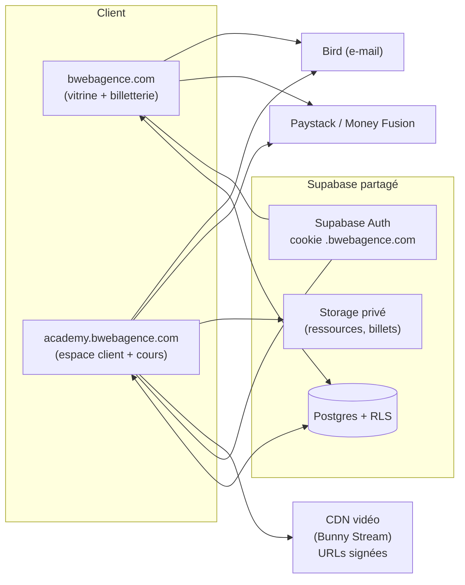

# Bweb Academy — Cahier des charges technique (v0.1 — brouillon)

> Plateforme e-learning **`academy.bwebagence.com`**, reliée au site vitrine/billetterie existant (`bwebagence.com`).
> Objectif : un **espace client unifié** où l'apprenant suit **toutes** ses activités de formation — présentiel, live (Zoom), et cours vidéo à la demande — et une **administration complète** pour gérer une académie en ligne.
>
> Statut : premier jet à valider. Les points marqués **[À VALIDER]** attendent une décision.

---

## 1. Contexte & vision

Le site actuel (`bwebagence.com`) est une **vitrine + billetterie** de formations (Astro + Supabase + Vercel) : catalogue de formations, sessions datées (présentiel / en ligne / hybride), réservation, paiement (Paystack + Money Fusion), packs de parcours, CRM clients, avis, e-mails transactionnels (Bird).

**Bweb Academy** étend cet écosystème avec une **plateforme d'apprentissage** :
- des **cours à la demande** (vidéos, ressources, quiz) achetables et consultables en ligne ;
- un **espace client (apprenant)** qui regroupe **toute** l'activité de formation d'une personne : ses réservations présentiel/live, ses cours à la demande, sa progression, ses attestations, ses factures, son agenda ;
- une **administration d'académie** (création de cours, suivi des apprenants, ventes, analytics).

**Principe directeur : un seul écosystème, deux applications.** L'Academy est un **nouveau front** sur un **sous-domaine dédié**, mais **branché sur la même base de données Supabase** que le site, pour que l'espace client soit réellement unifié.

---

## 2. Objectifs & indicateurs de succès

| Objectif | Indicateur |
|---|---|
| Vendre des cours à la demande | # ventes / CA cours en ligne |
| Fidéliser (LTV) via l'espace client | % clients avec ≥1 cours + ≥1 session |
| Faire progresser et certifier | Taux de complétion, # attestations émises |
| Réduire le support manuel | % accès auto-provisionnés après achat |
| Scaler l'offre sans logistique présentielle | Ratio revenus à la demande / présentiel |

---

## 3. Périmètre

### 3.1 Dans le périmètre (v1)
- Espace client apprenant unifié (login, tableau de bord, mes formations, progression, attestations, factures, agenda).
- Catalogue de cours à la demande + page de cours + **lecteur vidéo** avec suivi de progression.
- Structure pédagogique : **cours → modules → leçons** (vidéo, texte/riche, ressources téléchargeables, quiz simple).
- **Achat de cours** (à l'unité) via le site et l'Academy, réutilisant Paystack/Money Fusion.
- **Provisionnement automatique de l'accès** après paiement (comme l'enrôlement pack déjà en place).
- **Attestations / certificats** générés à la complétion.
- Administration : gestion des cours/contenus, des apprenants, des ventes, analytics de base.
- Notifications e-mail (Bird) : bienvenue, accès accordé, progression, rappels d'inactivité.

### 3.2 Hors périmètre v1 (backlog v2+)
- Abonnement / accès illimité (membership), coupons/codes promo avancés.
- Communauté (forum, Q&A, commentaires par leçon), messagerie apprenant↔formateur.
- Parcours certifiants multi-cours avec pré-requis et déblocage conditionnel avancé.
- Gamification (badges, points, classements), streaks.
- Application mobile native (le web responsive/PWA couvre la v1).
- Marketplace multi-formateurs avec reversements automatiques.
- Sous-titres automatiques / multilingue de l'interface (FR uniquement en v1).
- Visioconférence intégrée (on continue d'utiliser Zoom pour le live).

---

## 4. Intégration avec l'existant (le cœur du sujet)

### 4.1 Base de données : **Supabase partagé** [RECOMMANDÉ]
Réutiliser le **même projet Supabase** que le site (`ykoiqpudscthafszswcl`). Avantages :
- Espace client réellement **unifié** : les `bookings` (présentiel/live), les droits de pack (`pack_entitlements`) et les cours à la demande cohabitent pour un même client.
- Une seule identité client, un seul CRM (`customers`), un seul historique.
- Réutilisation immédiate de `formations`, `sessions`, `packs`, `reviews`, des RPC et de la logique RLS.

L'Academy ajoute ses tables (préfixe conseillé `course_*`, `lesson_*`, `enrollment_*`…) sans casser l'existant. *(Alternative — base séparée + synchronisation — écartée : complexité et perte de l'unification. [À VALIDER] si contrainte contraire.)*

### 4.2 Authentification : introduction des **comptes clients** (Supabase Auth)
Aujourd'hui, seuls les **admins** ont un compte ; les réservations se font par e-mail sans login. L'espace client impose une **authentification apprenant**.

- **Supabase Auth** (email + mot de passe et/ou **magic link** / OTP e-mail — recommandé pour l'Afrique de l'Ouest, moins de friction). Option Google plus tard.
- Table `profiles` (1-1 avec `auth.users`) reliée à `customers` **par e-mail** (rapprochement automatique de l'historique de réservations existant).
- **SSO léger inter-domaines** : `bwebagence.com` et `academy.bwebagence.com` partagent la session via un cookie sur le domaine parent `.bwebagence.com` (Supabase Auth configuré avec `cookieOptions.domain = ".bwebagence.com"`). L'utilisateur se connecte une fois, navigue entre les deux.
- Après login, **réconciliation** : tout `booking`/`pack_purchase`/`course_enrollment` portant le même e-mail est rattaché au compte.

### 4.3 Le lien « achat → accès »
Modèle déjà éprouvé avec les packs (`pack_purchases` → `pack_entitlements` → enrôlement auto). On applique le **même patron** :
- Achat d'un cours sur le site ou l'Academy → `course_enrollment` créé après **confirmation de paiement** (mêmes points de confirmation : page retour, webhook Paystack, cron de réconciliation).
- Un **pack** peut inclure des **cours à la demande** en plus des sessions (extension de `pack_items` pour pointer une `formation` **et/ou** un `course`). [À VALIDER — souhaité ?]
- Les **présentiel/live** restent gérés par le site (billetterie) ; l'Academy les **affiche** dans l'espace client (lecture des `bookings`).

### 4.4 Paiement & e-mail : **réutilisés tels quels**
- Paiement : **Paystack** (+225) / **Money Fusion** (relais IP fixe Hostinger) — endpoints `/api/paystack/init`, `/api/pack-reserver`-like, page de retour partagée. Un endpoint `academy` équivalent (`/api/course-reserver`) suivra le même contrat.
- E-mail transactionnel : **Bird** (SDK, expéditeur `no-reply@mail.bwebagence.com`) + gabarit de marque existant (`shell()`).
- CRON : réutiliser le pattern `CRON_SECRET` + crons Vercel (réconciliation paiements, rappels).

### 4.5 Cohérence de marque
Réutiliser les **tokens de design** (`tokens.css` : navy `#020b50`, bleu `#1f6ced`, menthe `#00c89e`, ambre `#f0a500`, Sora/Jakarta) et, si même stack, les **composants UI maison**. L'Academy doit être visuellement une continuité du site.

---

## 5. Architecture technique

### 5.1 Domaine & hébergement
- **`academy.bwebagence.com`** — application dédiée, déployée sur **Vercel** (même compte), projet distinct.
- Cookies d'auth sur `.bwebagence.com` (SSO inter-sous-domaines).
- Assets statiques via CDN Vercel ; **vidéos via CDN vidéo dédié** (cf. §5.3).

### 5.2 Stack applicative [À VALIDER — 2 options]
- **Option A — Astro SSR (comme le site).** Cohérence maximale (mêmes composants, mêmes conventions, même équipe), SSR + îlots TS. Convient bien à un espace client à pages ; le lecteur de cours reste une page riche avec un peu de JS. **Recommandé pour la continuité et la vitesse de livraison.**
- **Option B — Next.js (App Router) / SPA.** Expérience plus « application » (navigation instantanée, état riche : player, progression temps réel). Plus adapté si l'Academy devient très interactive, au prix d'une stack en plus à maintenir.

> Recommandation : **Astro SSR** pour la v1 (réutilisation, time-to-market), avec des îlots interactifs (player, quiz, progression). Réévaluer Next.js si la roadmap v2 (communauté, temps réel) l'exige.

### 5.3 Hébergement & protection vidéo [DÉCISION IMPORTANTE]
Le stockage Supabase **n'est pas adapté** au streaming vidéo protégé à l'échelle. Recommandation : un **service vidéo dédié** avec CDN + URLs signées + adaptatif (ABR) :
- **Bunny Stream** [RECOMMANDÉ] — coût faible, CDN performant en Afrique de l'Ouest, **token authentication** (URLs signées expirantes), lecteur intégrable, encodage ABR (adaptatif au débit — crucial pour la CI). 
- Alternatives : **Cloudflare Stream** (simple, signed URLs, DRM léger), **Mux** (qualité/analytics premium, plus cher).
- **Protection** : URLs signées **expirantes** par leçon + par utilisateur, referer/domain lock, watermark dynamique léger (e-mail de l'apprenant en surimpression) pour dissuader le partage. Pas de DRM lourd en v1.
- Les **ressources téléchargeables** (PDF, templates) : Supabase Storage privé + URLs signées côté serveur (déjà utilisé pour les billets/justificatifs).

### 5.4 Schéma d'architecture (haut niveau)

---

## 6. Rôles & permissions

| Rôle | Périmètre |
|---|---|
| **Visiteur** | Catalogue public, pages de cours (aperçu/leçons gratuites), achat. |
| **Apprenant** (compte client) | Son espace : cours achetés, progression, attestations, factures, agenda, sessions présentiel/live. |
| **Formateur** | Création/édition de ses cours et contenus, suivi des apprenants de ses cours. *(v1 : peut être fusionné avec Admin si un seul intervenant.)* |
| **Admin académie** | Tout : cours, apprenants, ventes, remboursements, analytics, paramètres. |

RLS Supabase : lecture des contenus **conditionnée à l'enrôlement** (un apprenant ne lit une leçon protégée que s'il a un `course_enrollment` actif) ; écritures de progression limitées à l'utilisateur ; administration via `is_admin()` (déjà en place).

---

## 7. Modèle de données (nouvelles tables)

> Convention : `snake_case`, `uuid` PK, RLS activée, `created_at/updated_at`. S'articule avec l'existant (`customers`, `formations`, `bookings`, `packs`).

- **`profiles`** — 1-1 `auth.users` : `id`, `full_name`, `email`, `phone`, `avatar_url`, `customer_id?` (lien CRM). 
- **`courses`** — un cours à la demande : `id`, `slug`, `title`, `subtitle`, `description_html`, `cover_url`, `trailer_video_id`, `level`, `formation_id?` (si adossé à une formation présentielle), `price`, `compare_at_price?`, `status` (draft/published/archived), `instructor_id?`, `sort`.
- **`course_modules`** — `id`, `course_id`, `title`, `sort`.
- **`lessons`** — `id`, `module_id`, `title`, `type` (video/text/pdf/quiz), `video_id?` (réf. Bunny), `duration_sec?`, `content_html?`, `is_preview` (accessible sans achat), `sort`.
- **`lesson_resources`** — `id`, `lesson_id`, `label`, `storage_path`, `size`.
- **`course_enrollments`** — droit d'accès : `id`, `course_id`, `user_id` (ou `customer_id`), `source` (achat/pack/offert), `order_ref?`, `status` (active/refunded/expired), `expires_at?`, `granted_at`.
- **`lesson_progress`** — `id`, `enrollment_id`, `lesson_id`, `status` (started/completed), `seconds_watched`, `completed_at`. Unique(`enrollment_id`,`lesson_id`).
- **`quizzes`** / **`quiz_questions`** / **`quiz_attempts`** — évaluation simple (QCM), score, réussite.
- **`certificates`** — `id`, `enrollment_id`, `serial`, `issued_at`, `pdf_path`. Émis à la complétion (≥ seuil).
- **`course_purchases`** — achat de cours (miroir de `pack_purchases`) : client, montant, `payment_status`, `payment_reference`, `payment_method`. → crée les `course_enrollments` à la confirmation.
- **Extensions de l'existant** : `pack_items.course_id?` (packs incluant des cours) [À VALIDER] ; `reviews` réutilisée pour les avis de cours (ajout `course_id?`).

### 7.1 Ce qui est réutilisé tel quel
`customers` (CRM), `bookings` + `sessions` + `pack_entitlements` (affichés dans l'espace client), `is_admin()`, `booking_emails` (anti-doublon e-mails), `packs`.

---

## 8. Fonctionnalités détaillées

### 8.1 Espace client / apprenant (le cœur)
- **Tableau de bord** : « Continuer là où j'en étais » (dernière leçon), progression globale, prochaines sessions présentiel/live (depuis `bookings`), nouveautés.
- **Mes formations** — vue unifiée en 3 familles :
  - **À la demande** (cours vidéo) : progression %, reprise.
  - **Présentiel / Live** (sessions billetterie) : date, lieu/lien Zoom, billet, ajout agenda.
  - **Packs** : places prépayées, statut d'enrôlement par formation (déjà modélisé).
- **Progression & historique** : leçons complétées, temps passé, quiz réussis.
- **Attestations** : téléchargement PDF des cours/formations terminés.
- **Factures / reçus** : historique des achats (site + academy).
- **Agenda** : sessions à venir + rappels (réutilise `lib/calendar` .ics/Google).
- **Profil** : coordonnées, mot de passe, préférences e-mail (opt-out réutilisé).

### 8.2 Catalogue & page de cours (public)
- Catalogue filtrable (thème, niveau, prix), cartes de cours, avis/notes.
- Page de cours : présentation, plan (modules/leçons), **leçons d'aperçu gratuites**, formateur, avis, prix, **CTA achat**. SEO soigné (comme les pages formation).

### 8.3 Lecteur de cours (apprenant enrôlé)
- **Player vidéo** (Bunny) : reprise à la seconde, vitesse, plein écran, mémorisation de la position.
- **Sommaire** modules/leçons avec état (à faire / en cours / terminé), navigation précédent/suivant.
- **Marquer comme terminé** (auto à ~90 % visionné, ou manuel), progression temps réel.
- **Ressources** téléchargeables par leçon (URLs signées).
- **Quiz** de fin de module/cours (QCM), score, condition de complétion.
- Reprise cross-device (progression serveur).

### 8.4 Évaluations & certification
- Quiz QCM configurables (bonne(s) réponse(s), score minimal).
- **Attestation PDF** générée à la complétion (nom, cours, date, n° de série vérifiable) — réutilise la chaîne PDF existante (`billetPdf`-like) + page publique de vérification `/verifier/{serial}`.

### 8.5 Administration académie (back-office)
- **Cours** : CRUD cours, modules, leçons (upload vidéo → Bunny, éditeur riche TipTap déjà en place), ressources, aperçu.
- **Publication** (draft → published) façon pastille (comme les sessions).
- **Apprenants** : liste, détail (achats, progression, attestations), accorder/révoquer un accès manuellement.
- **Ventes** : transactions cours, réconciliation, remboursements (révoque l'enrôlement).
- **Analytics** : ventes, complétion par cours, leçons « décrochage », apprenants actifs.
- **Avis** : modération (réutilise le module avis existant).
- Intégré à l'admin existant (nouvelle section « Academy ») **ou** back-office dédié [À VALIDER].

### 8.6 Monétisation
- **Achat à l'unité** d'un cours (v1). 
- **Cours adossé à une formation** : option « repartez avec le cours en ligne » en **order bump** (patron déjà construit pour le pack) — auto-calcul possible. 
- **Packs incluant des cours** (extension des packs) [À VALIDER].
- **Abonnement / accès illimité** (v2).

### 8.7 Notifications (Bird)
Bienvenue + accès accordé, reçu/attestation, rappel d'inactivité (« reprenez votre cours »), nouveau cours disponible, rappels de sessions (déjà en place). Anti-doublon via `booking_emails`-like.

---

## 9. Parcours utilisateurs clés

1. **Achat d'un cours** (visiteur → apprenant) : catalogue → page cours → achat (Paystack/MF) → confirmation → `course_enrollment` auto → e-mail d'accès → 1ʳᵉ leçon.
2. **Apprentissage** : login → tableau de bord → reprise → leçon → progression enregistrée → quiz → complétion → attestation.
3. **Client existant du site** : se connecte pour la 1ʳᵉ fois (magic link) → l'historique de ses réservations/pack apparaît automatiquement (réconciliation par e-mail) → il découvre les cours à la demande.
4. **Upsell** : à la réservation d'une session, order bump « + le cours en ligne » (ou « + le pack »).

---

## 10. Exigences non fonctionnelles

- **Sécurité** : RLS stricte (accès leçon ⇔ enrôlement), URLs vidéo/ressources **signées et expirantes**, pas de secret côté client, clé service serveur uniquement (comme aujourd'hui). Watermark e-mail sur les vidéos (dissuasion).
- **RGPD / données** : réutiliser la base légale et l'opt-out du CRM existant ; export/suppression de compte ; consentement cookies (déjà géré côté site).
- **Performance & réseau (Côte d'Ivoire)** : ABR vidéo (Bunny) pour bas débit, images optimisées, SSR + cache, poids maîtrisé, **fonctionne bien en 3G/4G** et sur mobile d'entrée de gamme.
- **Mobile-first / responsive** ; **PWA** (installable, reprise hors-ligne des ressources téléchargées) — nice-to-have v1.
- **Accessibilité** (AA), **i18n** FR (structure prête pour EN plus tard).
- **SEO** des pages catalogue/cours publiques.
- **Observabilité** : logs, suivi des erreurs de paiement (comme la réconciliation actuelle).
- **Fiabilité** : provisionnement d'accès **idempotent** (confirmations rejouables : retour + webhook + cron), comme pour les packs.

---

## 11. Roadmap / phasage proposé

- **Phase 0 — Fondations (1 sprint)** : auth clients (Supabase Auth + SSO `.bwebagence.com`), `profiles`, réconciliation par e-mail, coquille de l'espace client affichant l'historique existant (bookings/packs).
- **Phase 1 — MVP cours (2–3 sprints)** : modèle `courses/modules/lessons`, admin de création + upload Bunny, page de cours publique, achat (réutilise paiement) + enrôlement auto, lecteur vidéo + progression, tableau de bord apprenant.
- **Phase 2 — Certification & polish (1–2 sprints)** : quiz, attestations PDF + vérification, e-mails cycle de vie, analytics admin, avis de cours.
- **Phase 3 — Croissance (backlog)** : order bump cours, packs incluant des cours, abonnement, communauté/Q&A, gamification, PWA/offline avancé.

*(Estimations à affiner selon l'équipe et l'option de stack.)*

---

## 12. Décisions à valider (avant de construire)

1. **Base partagée Supabase** (recommandé) vs base séparée ? 
2. **Stack Academy** : Astro SSR (recommandé, continuité) vs Next.js (app riche) ?
3. **Hébergement vidéo** : Bunny Stream (recommandé) vs Cloudflare Stream vs Mux ? Budget mensuel cible ?
4. **Auth** : magic link/OTP e-mail (recommandé, moins de friction) + mot de passe ? Google plus tard ?
5. **Packs incluant des cours** (extension `pack_items`) souhaité dès v1 ?
6. **Certificats** : gabarit/design, seuil de complétion (ex. 90 %), signature/QR de vérification ?
7. **Back-office** : section « Academy » dans l'admin existant, ou back-office séparé ?
8. **Modèle éco v1** : achat à l'unité seulement, ou aussi abonnement dès le départ ?
9. **Formateurs** multiples (rôle dédié) ou un seul intervenant (Admin = Formateur) en v1 ?
10. **Contenu de départ** : combien de cours au lancement, quel format (durée, ressources) ?

---

## 13. Risques & points d'attention
- **Piratage vidéo** : atténué (URLs signées + watermark), jamais nul → accepter un risque résiduel raisonnable.
- **Bande passante utilisateur** : dépendance forte à l'ABR et au CDN → choisir un fournisseur performant en Afrique de l'Ouest.
- **Complexité de l'unification** : bien cadrer la réconciliation `auth.users` ↔ `customers` (doublons d'e-mails, casse, téléphone).
- **Coûts vidéo** qui montent avec l'audience (stockage + diffusion) → suivre le coût/heure diffusée.
- **Périmètre** : tenir la v1 (MVP) et repousser la communauté/gamification.

---

*Document de travail — à faire évoluer après validation des points du §12. Prochaine étape suggérée : trancher les décisions clés (base partagée, stack, hébergement vidéo, auth), puis détailler le schéma SQL de la Phase 1 et les maquettes de l'espace client.*
